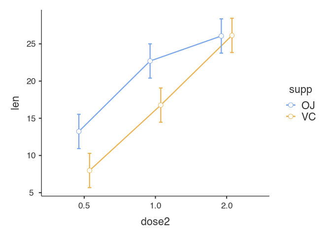

<!-- README.md is generated from README.Rmd. Please edit that file -->

# jmvReadWrite

<!-- badges: start -->

[](https://cran.r-project.org/package=jmvReadWrite)
[](https://www.gnu.org/licenses/agpl-3.0.html)
[](https://cran.r-project.org/package=jmvReadWrite)
[](https://cran.r-project.org/package=jmvReadWrite)
[](https://github.com/sjentsch/jmvReadWrite)
<!-- badges: end -->

<!---
[//]: [](https://travis-ci.org/eddelbuettel/rprotobuf)
[//]: [](https://github.com/eddelbuettel/rprotobuf/actions?query=workflow%3Aci)
[//]: [](https://dx.doi.org/10.18637/jss.v071.i02)
--->

The R-package `jmvReadWrite` reads and writes the .omv-files that are
used by the statistical spreadsheet `jamovi` (www.jamovi.org). It is
supposed to ease using syntax for statistical analyses created using the
GUI in `jamovi` in connection with the R-library `jmv`.

## Installation

You can either install a stable version of `jmvReadWrite` which is
available on [CRAN](https://cran.r-project.org/package=jmvReadWrite)
using the following command:

``` r
install.packages("jmvReadWrite")
```

or you can install the development version of the `jmvReadWrite` package
from [GitHub](https://github.com/sjentsch/jmvReadWrite):

``` r
if(!require(devtools)) install.packages("devtools")
devtools::install_github("sjentsch/jmvReadWrite")
```

## How to use the package?

The following code uses the ToothGrowth-data set that is part of the
data sets included in R (the current file contains some modifications
though for testing the reading and writing routines: `read_omv` and
`write_omv`). With this data set, a syntax to conduct an ANOVA is run.

The results should be similar to those obtained when running the same
analysis in jamovi (using the GUI). To do so, open the file menu (☰)
choose `Open`, `Data Library` and `ToothGrowth`. Afterwards, click on
the `ANOVA`-button in the `Analyses`-tab and choose `ANOVA`. There, you
assign the variable `len` to `Dependent Variable` and `supp` and `dose`
to `Fixed Factors`. Afterwards, you choose / tick `Overall Model Test`
and `ω²`. Open the drop-down menu `Assumption Checks` and tick
`Homogeneity test` and `Normality test`. The results should be identical
apart from that the table output looks nicer in `jamovi` (not only text,
as below), numbers are rounded and maybe one or two other cosmetic
differences.

If you want to copy the syntax generated in jamovi, you have to switch
on the [`Syntax
Mode`](https://jamovi.readthedocs.io/en/latest/_pages/um_6_syntax_mode.html).
Afterwards, the syntax is shown at the top of the analysis and can be
copied from there.

``` r
library(jmvReadWrite)
library(jmv)

data = read_omv(fleNme = system.file("extdata", "ToothGrowth.omv", package = "jmvReadWrite"))
jmv::ANOVA(
    formula = len ~ supp + dose + supp:dose,
    data = data,
    effectSize = c("omega"),
    modelTest = TRUE,
    homo = TRUE,
    norm = TRUE)
#> 
#>  ANOVA
#> 
#>  ANOVA - len                                                                                      
#>  ──────────────────────────────────────────────────────────────────────────────────────────────── 
#>                     Sum of Squares    df    Mean Square    F            p             ω²          
#>  ──────────────────────────────────────────────────────────────────────────────────────────────── 
#>    Overall model         2740.1033     5      548.02067    41.557178    < .0000001                
#>    supp                   205.3500     1      205.35000    15.571979     0.0002312    0.0554519   
#>    dose                  2426.4343     2     1213.21717    91.999965    < .0000001    0.6925788   
#>    supp:dose              108.3190     2       54.15950     4.106991     0.0218603    0.0236466   
#>    Residuals              712.1060    54       13.18715                                           
#>  ──────────────────────────────────────────────────────────────────────────────────────────────── 
#> 
#> 
#>  ASSUMPTION CHECKS
#> 
#>  Homogeneity of Variances Test (Levene's) 
#>  ──────────────────────────────────────── 
#>    F           df1    df2    p           
#>  ──────────────────────────────────────── 
#>    1.940130      5     54    0.1027298   
#>  ──────────────────────────────────────── 
#> 
#> 
#>  Normality Test (Shapiro-Wilk) 
#>  ───────────────────────────── 
#>    Statistic    p           
#>  ───────────────────────────── 
#>    0.9849884    0.6694242   
#>  ─────────────────────────────
```

Since version 0.2.0, read\_omv also extracts the syntax from analyses
that you may have conducted in the jamovi-GUI and that are stored in the
.omv-file. To extract them, you have to set the parameter `getSyn =
TRUE` when calling read\_omv (default is `FALSE`). When the parameter is
set, the analyses are stored in the attribute `syntax`. They can be used
as shown in the following examples:

``` r
library(jmvReadWrite)

data = read_omv(fleNme = system.file("extdata", "ToothGrowth.omv", package = "jmvReadWrite"), getSyn = TRUE)
# shows the syntax of the analyses from the .omv-file
attr(data, 'syntax')
#> [[1]]
#> [1] "jmv::ANOVA(formula = len ~ supp + dose2 + supp:dose2, data = data, effectSize = \"partEta\", modelTest = TRUE, qq = TRUE, emMeans = ~ dose2:supp)"
#> 
#> [[2]]
#> [1] "jmv::ancova(formula = len ~ supp + dose, data = data, effectSize = \"partEta\", modelTest = TRUE)"
# runs the command of the first analysis
eval(parse(text=attr(data, 'syntax')[[1]]))
#> 
#>  ANOVA
#> 
#>  ANOVA - len                                                                                      
#>  ──────────────────────────────────────────────────────────────────────────────────────────────── 
#>                     Sum of Squares    df    Mean Square    F            p             η²p         
#>  ──────────────────────────────────────────────────────────────────────────────────────────────── 
#>    Overall model         2740.1033     5      548.02067    41.557178    < .0000001                
#>    supp                   205.3500     1      205.35000    15.571979     0.0002312    0.2238254   
#>    dose2                 2426.4343     2     1213.21717    91.999965    < .0000001    0.7731092   
#>    supp:dose2             108.3190     2       54.15950     4.106991     0.0218603    0.1320279   
#>    Residuals              712.1060    54       13.18715                                           
#>  ────────────────────────────────────────────────────────────────────────────────────────────────
```



``` r
# runs the command of the second analysis and assigns the output from that analysis to the variable result2
eval(parse(text=paste0('result2 = ', attr(data, 'syntax')[[2]])))
names(result2)
#> [1] "main"      "assump"    "contrasts" "postHoc"   "emm"       "residsOV"
# → "main"      "assump"    "contrasts" "postHoc"   "emm" (the names of the five output tables)
```

The `jmvReadWrite`-package also enables you to write `.omv`-files in
order to use them in `jamovi`. Let’s assume that you have a large
collection of log-files (e.g., from an experiment) that you compile and
process (summarize, filter, etc.) in R in order to later analyse them in
`jamovi`. You will have those processed log-files stored in a data frame
(called, e.g., `data`) which you then write to a file that you can open
in jamovi afterwards. Although jamovi reads R-data files (.RData, .rda,
.rds) `write_omv` permits to store `jamovi`-specific attributes (such as
variable labels) in addition.

``` r
library(jmvReadWrite)

write_omv(dtaFrm = data, fleNme = 'Trial.omv')
```

-----

[Changelog](https://github.com/sjentsch/jmvReadWrite/blob/main/CHANGELOG.md)

## Authors

[Sebastian Jentschke](https://www.uib.no/en/persons/Sebastian.Jentschke)

## License

[AGPL 3](https://github.com/sjentsch/jmvReadWrite/blob/main/LICENSE)
